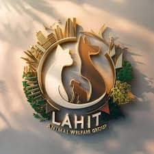

<div align="center">

  

  # LAHIT Animal Welfare

  **A modern digital home for animal rescue, rehabilitation, adoption, and community action across Uttarakhand.**

  <p>
    <a href="https://github.com/Shwetanshu-Bhatt/lahit-animal-welfare">Repository</a>
    ·
    <a href="https://github.com/Shwetanshu-Bhatt/lahit-animal-welfare/issues">Report an issue</a>
  </p>

  <p>
    
    
    
    
  </p>

</div>

## About

LAHIT is a volunteer-led animal-welfare platform built to make it easier to help animals and coordinate the people behind that work. The public website connects supporters with rescue stories, animals looking for homes, volunteering opportunities, emergency reporting, donations, and updates from the field.

Behind the public site is an authenticated operations area for managing animals, rescues, blogs, media, impact statistics, volunteers, adoption inquiries, rescue reports, and site settings.

## Highlights

- Public, mobile-first animal-welfare website
- Animal adoption listings and adoption-interest workflow
- Rescue stories with before/after imagery and map locations
- Emergency rescue reporting for registered volunteers
- Volunteer registration, approval, account access, and password recovery
- Admin dashboard for content, media, volunteers, reports, inquiries, and impact data
- Blog publishing and media management
- MongoDB persistence through Mongoose
- NextAuth credentials authentication with role-aware access
- Cloudinary image uploads for managed media
- SMTP or Brevo email support for account and password-reset flows
- Responsive UI with Tailwind CSS, DaisyUI, Framer Motion, Leaflet, and Lucide icons

## Technology

- **Framework:** Next.js App Router
- **Language:** JavaScript with ES modules
- **UI:** React, Tailwind CSS, DaisyUI, Framer Motion
- **Data:** MongoDB and Mongoose
- **Authentication:** NextAuth.js with credentials and JWT sessions
- **Images:** Cloudinary
- **Email:** Nodemailer SMTP or Brevo API
- **Maps:** Leaflet and React Leaflet

## Getting started

### Prerequisites

- Node.js 20.9 or newer
- npm
- A MongoDB database (local or hosted)

### Installation

```bash
git clone https://github.com/Shwetanshu-Bhatt/lahit-animal-welfare.git
cd lahit-animal-welfare
npm install
```

Create a local environment file:

```bash
cp .env.example .env
```

Fill in the required values, then start the development server:

```bash
npm run dev
```

Open [http://localhost:3000](http://localhost:3000).

## Environment variables

### Required

| Variable | Purpose |
| --- | --- |
| `MONGODB_URI` | MongoDB connection string |
| `NEXTAUTH_URL` | Canonical application URL, for example `http://localhost:3000` |
| `NEXTAUTH_SECRET` | Secret used to sign NextAuth sessions |

### Email

Configure either SMTP or Brevo for password resets and transactional email. The supported SMTP variables are `SMTP_HOST`, `SMTP_PORT`, `SMTP_SECURE`, `SMTP_USER`, `SMTP_PASS`, and `SMTP_FROM`.

Alternatively, use Brevo's API with `BREVO_API_KEY`, `BREVO_SENDER_EMAIL`, and `BREVO_SENDER_NAME`. In development, email flows can run without a configured provider and log the intended message instead.

### Image storage

Admin image uploads and image migration require the server-side Cloudinary credentials:

```env
CLOUDINARY_CLOUD_NAME=your-cloud-name
CLOUDINARY_API_KEY=your-api-key
CLOUDINARY_API_SECRET=your-api-secret
```

Never commit `.env` or expose server secrets in client-side code.

## Database setup

For a local development database, the seed script can create sample content and development accounts:

```bash
npm run seed
```

The seeded credentials are intended for local development only. Change or remove them before using a shared or production database.

If existing local image URLs need to be moved to Cloudinary, use:

```bash
npm run migrate:images
```

## Useful routes

| Route | Description |
| --- | --- |
| `/` | Public home page and impact overview |
| `/animals` | Animals available for adoption |
| `/rescues` | Rescue stories and locations |
| `/blog` | News and animal-welfare stories |
| `/login` | Public account login |
| `/admin/login` | Admin login |
| `/candidate/login` | Volunteer login |
| `/candidate` | Volunteer dashboard and reports |
| `/admin` | Protected administration dashboard |

## Project structure

```text
lahit-welfare/
├── app/             # Pages, layouts, protected areas, and API routes
├── components/      # Public, admin, candidate, auth, and UI components
├── data/            # Local fallback and presentation data
├── lib/             # Database, auth, mail, uploads, and API helpers
├── models/          # Mongoose models
├── public/          # Logo and static images
└── scripts/         # Database seed and Cloudinary migration scripts
```

## Available scripts

| Command | Description |
| --- | --- |
| `npm run dev` | Start the local development server |
| `npm run build` | Create a production Next.js build |
| `npm run start` | Start the production server |
| `npm run lint` | Run ESLint |
| `npm run seed` | Seed local development data |
| `npm run migrate:images` | Migrate managed images to Cloudinary |

## Deployment

LAHIT is a server-rendered Next.js application. Deploy it to a platform that supports a Next.js server, such as [Vercel](https://vercel.com/), and configure the production environment variables in the hosting dashboard.

Before going live:

1. Use a production MongoDB database with restricted access.
2. Generate a strong, unique `NEXTAUTH_SECRET`.
3. Configure a verified email sender and production mail provider.
4. Configure Cloudinary server credentials if admins will upload images.
5. Remove seeded development users and sample credentials.
6. Run `npm run build` and verify the public, admin, volunteer, email, and upload flows.

## Contributing

Improvements, bug reports, and animal-welfare ideas are welcome. Open an issue with enough context to reproduce a problem, or submit a focused pull request with the relevant checks included.

## License

LAHIT Animal Welfare is maintained for the LAHIT initiative. No open-source license has been added to this repository yet; please contact the maintainers before redistributing or reusing the code.

<div align="center">

  Built with care for animals and the people who help them.

</div>
